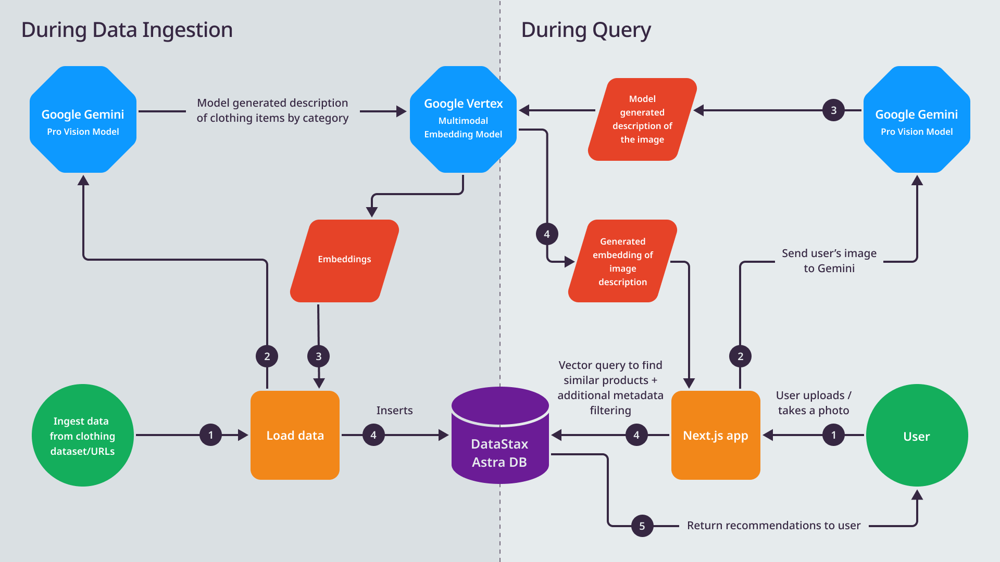

# Fashion Buddy

Fashion Buddy is a multimodal RAG application powered by DataStax Astra DB which performs a similarity search on the clothing worth in a users image.



## Getting Started

### Prerequisites

- An Astra DB account. You can [create one here](https://astra.datastax.com/register).
    - An Astra Vector Database
- A GoogleAI account and API Key [create one here](https://ai.google.dev/)
- A Cohere account and api key [create one here](https://cohere.com/)


### Setup

1. Clone this repository to your local machine.
2. Install the dependencies by running `npm install` in your terminal.
3. Set up the following environment variables in your IDE or `.env` file:
    - `GOOGLE_API_KEY`: api key from Google
    - `ASTRA_DB_ENDPOINT`: Your Astra DB vector database endpoint
        - Copy from the `Database Detail`
    - `ASTRA_DB_APPLICATION_TOKEN`: The generated app token for your Astra database
        - To create a new token go to your database's `Connect` tab and click `Generate Token`. (your Application Token begins with `AstraCS:...`)

### Load your DB

This app uses a sample dataset of Zara clothing from [Kaggle](https://www.kaggle.com/datasets/abhinavtyagi2708/zara-dataset-men-and-women-clothing?resource=download)

Run `npm run load` to load the dataset. This can take a long time so run it as long as you see fit (there will be failures mainly due to items that are no longer active).
This step calls Gemini with each product image and gets an item description to embed and add to your collection.


### Run the application

Run the development server:

```bash
npm run dev
# or
yarn dev
# or
pnpm dev
# or
bun dev
```

Open [http://localhost:3000](http://localhost:3000) with your browser to see the result.


## Learn More

To learn more about Next.js, take a look at the following resources:

- [Next.js Documentation](https://nextjs.org/docs) - learn about Next.js features and API.
- [Learn Next.js](https://nextjs.org/learn) - an interactive Next.js tutorial.

You can check out [the Next.js GitHub repository](https://github.com/vercel/next.js/) - your feedback and contributions are welcome!

## Deploy on Vercel

You can easily deploy your chatbot to Vercel by clicking the button below:

[](https://vercel.com/new/clone?repository-url=https://github.com/riptano/fashion-buddy&env=ASTRA_DB_API_ENDPOINT,ASTRA_DB_APPLICATION_TOKEN,GOOGLE_API_KEY)

Remember to set your environment variables to the values obtained when setting up your Astra DB and Google accounts.
